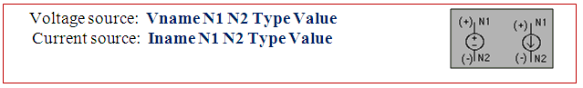
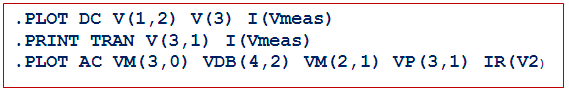
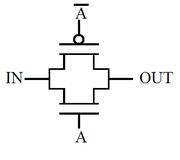
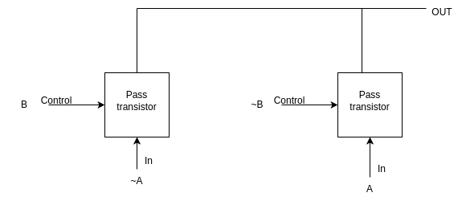
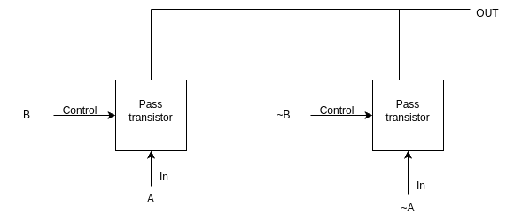

## SPICE 

A spice input file, also called source file, consistsof three parts:

  - **Data statements:** These statements are description of the components and their I nterconnections.

  - **Control statements:** These statements are responsible to tell SPICE simulator what type of analysis to perform on the circuit.

  - **Output statements:** These statements specify what outputs are to be printed or plotted.

   Although these statements may appear in any order, it is recommended that they be given in the above sequence. Two other statements are required: the title statement and the end statement. The title statement is the first line and can contain any information, while the end statement is always .END. The title statement must be a line or word. In addition, you can insert comment statements, which must begin with an asterisk (*) and are ignored by SPICE Simulator.

  **1. Data Statements**

  (A).Independent DC Sources

   N1 is the positive terminal node. N2 is the negative terminal node. Type can be DC, AC or TRAN, depending on the type of analysis. Value gives the value of the source. The name of a voltage and current source must start with V and I, respectively.

   The positive current direction through the current or voltage source is from the positive (N1) node to the negative (N2) node:

(B) Elements: for example MOSFETS

   The MOS transistor name (Mname) has to start with a M; ND, NG, NS and NB are the node numbers of the Drain, Gate, Source and Bulk terminals, respectively. ModName is the name of the transistor model (NMOS or PMOS). L and W are the length and width of the gate (in m).

  2. Commands or Control Statements:

 .TRAN Statement

 
  
   This statement specifies the time interval over which the transient analysis takes place, and the time increments. The format is as follows: TSTEP is the printing increment. TSTOP is the final time TSTART is the starting time (if omitted, TSTART is assumed to be zero) TMAX is the maximum step size. UIC stands for Use Initial Conditions. If UIC is specified then simulator will use the initial conditions specified in the element statements.

 3.Output Statements

 These statements will instruct Simulator what output to generate. If you do not specify an output statement, Simulator will always calculate the DC operating points. The two types of outputs are the prints and plots. A print is a table of data points and a plot is a graphical representation. The format is as follows:

 In above format TYPE specifies the type of analysis to be printed or plotted and can be:

 The output variables are Y1, Y2 and can be voltage or currents in voltage sources. Node voltages and device currents can be specified as magnitude (M), phase (P), real (R) or imaginary (I) parts by adding the suffix to V or I as follows:

 M: Magnitude.

 DB: Magnitude in dB (decibels).

 P: Phase.

 R: Real part.

 I: Imaginary part.

Complete example (Inverter-Netlist):

 In introduction of this experiment we have seen what is spice actually. In first experiment we have designed inverter, so as we have read in introduction that whenever you place anyting like transistor or capacitor etc., there is a code which is written at back end corresponding to the element placed on screen. So in this experiment we are going to learn what is taht code which is written in the back end, that is, we learn how to write that code directly, that is, we will learn basic inverter designing using spice coding.

 The following is the code for inverter in spice along with some of the explaination.

Now we will be learning actually what parameters are specified by each of the element in every line in detail

 **FIRST LINE**

  First line of spice code is always a comment. So this line is always ignored by spice. Spice does not do any kind of processing on this line.

 **INCLUDE LINE**

 .include line includes the model file but you should confirm that your model file should be in your current directory in which you are working.

1. **.lib 'models25.txt'**
   - This line includes a library file named 'models25.txt.' The library file typically contains information about models for various components used in the circuit.

2. **TT mn1 VSS IN OUT VSS nmos |=0.24u w=0.72u**
   - Defines an nmos transistor named 'mn1' with specific characteristics:
     - `TT`: Type or Model Name (nmos transistor).
     - `mn1`: Instance name.
     - `VSS IN OUT VSS`: Connections for source, gate, drain, and bulk (substrate).
     - `nmos`: Specifies the transistor type.
     - `|=0.24u`: Sets the zero-bias threshold voltage to 0.24 volts.
     - `w=0.72u`: Specifies the width of the transistor as 0.72 microns.

3. **mp1 VDD IN OUT VDD pmos |=0.24u w=0.72u**
   - Similar to the previous line but for a pmos transistor:
     - `mp1`: Instance name.
     - `VDD IN OUT VDD`: Connections for source, gate, drain, and bulk.
     - `pmos`: Specifies the transistor type.
     - `|=0.24u`: Sets the zero-bias threshold voltage to 0.24 volts.
     - `w=0.72u`: Specifies the width of the transistor as 0.72 microns.

4. **cLoad OUT VSS 50fF**
   - Defines a capacitor named 'cLoad':
     - `OUT VSS`: Connections for one terminal connected to OUT and the other to VSS.
     - `50fF`: Specifies the capacitance of the capacitor as 50 femtofarads.

5. **vVDD VDD 0 2.5**
   - Defines a voltage source named 'vVDD':
     - `VDD 0`: Connections for positive terminal to VDD and negative terminal to the reference node (0 volts).
     - `2.5`: Specifies the voltage value as 2.5 volts.

6. **vVSS VSS 0 0**
   - Defines a voltage source named 'vVSS':
     - `VSS 0`: Connections for positive terminal to VSS and negative terminal to the reference node (0 volts).
     - `0`: Specifies the voltage value as 0 volts.

7. **VIN IN 0 pulse(0 2.5 100ps 100ps 100ps 2ns 4ns)**
   - Defines a pulse voltage source named 'VIN':
     - `IN 0`: Connections for positive terminal to IN and negative terminal to the reference node (0 volts).
     - `pulse(0 2.5 100ps 100ps 100ps 2ns 4ns)`: Specifies the pulse characteristics:
        - `0 2.5`: Pulse amplitude from 0 to 2.5 volts.
        - `100ps`: Rise time.
        - `100ps`: Fall time.
        - `100ps`: Pulse width.
        - `2ns`: Period.
        - `4ns`: Delay.

8. **.dc vIN start=0 stop=2.5 step=0.01**
   - Specifies a DC sweep analysis of the voltage source 'vIN':
     - `start=0`: Starting voltage value.
     - `stop=2.5`: Ending voltage value.
     - `step=0.01`: Voltage step size.

9. **.tran 1ps 8ns**
   - Specifies a transient analysis with:
     - `1ps`: Time step of 1 picosecond.
     - `8ns`: Total simulation time of 8 nanoseconds.

10. **.option post**
    - Sets a post-processing option, which may include additional analysis or data extraction after the simulation. This line directs spice to make an output file

11. **.end**
    - Marks the end of the spice code.

## TRANSISTOR LEVEL XOR, XNOR GATES

### PASS TRANSISTORS:
Transmission gate is the parallel combination of NMOS and PMOS. When control signal (signal A) is high then transmission gate passes signal from input to output. 

**TRUTH TABLE**

**NMOS PASS TRANSISTOR**:
|IN |	CONTROL |	OUT|
|---|---------|----|
|0  |	0       |	X  |
|1 	| 0 	    | X  |
|0 	| 1 	    | 0  |
|1 	| 1       |	1  |

**PMOS PASS TRANSISTOR**:
|IN |	CONTROL |	OUT|
|---|---------|----|
|0  |	0       |	0  |
|1 	| 0 	    | 1  |
|0 	| 1 	    | X  |
|1 	| 1       |	X  |

### XOR GATE USING PASS TRANSISTORS

An XOR gate using pass transistors typically employs transmission gates or pass gates to achieve the desired logic functionality. A transmission gate consists of two complementary pass transistors (NMOS and PMOS) connected in parallel between the input and output nodes. The operation of the XOR gate can be understood by analyzing the behavior of these pass transistors.

Here's a step-by-step explanation:

**Transmission Gate Structure**:

The XOR gate is constructed using two pass transistors for each input. For simplicity, let's consider two inputs, A and B.
Each input (A and B) is connected to the gates of a pair of complementary pass transistors, one NMOS and one PMOS. 
The connections are made as follows:

**Control Signals**:

The control signals determine whether the pass transistors are in the conducting or non-conducting state.
When the control signals of both are high, both the NMOS and PMOS pass transistors are ON (conducting), allowing signals to pass through. When the control signals are low, both transistors are OFF, blocking the signals.

**Signal Flow**:

Suppose A is one of the inputs. When the control signal for the A input which is ~B is high, implying that B is low, the pass transistors associated with A are ON, allowing the A signal to pass through to the output.
Conversely, when the control signal for A is low implying B is high, and the control signal for input ~A which is B is high, the pass transistors associated with ~A are ON, allowing the ~A signal to pass through to the output.
If both control signals are high or both are low, both sets of pass transistors are either ON or OFF, and no signal passes through.

**Output Formation**:

The output is formed by combining the signals from both inputs. This combination is typically achieved using additional pass transistors or logical gates.
The final output represents the XOR of the input signals – it is high when the inputs are different and low when the inputs are the same.
In summary, the XOR gate using pass transistors relies on the controlled conduction of NMOS and PMOS transistors to selectively allow input signals to pass through to the output. The control signals determine which input contributes to the output at any given time, producing the desired XOR logic behavior.

### XNOR GATE USING PASS TRANSISTORS

An XNOR gate using pass transistors typically employs transmission gates or pass gates to achieve the desired logic functionality. A transmission gate consists of two complementary pass transistors (NMOS and PMOS) connected in parallel between the input and output nodes. The operation of the XOR gate can be understood by analyzing the behavior of these pass transistors.

Here's a step-by-step explanation:

**Transmission Gate Structure**:

The XOR gate is constructed using two pass transistors for each input. For simplicity, let's consider two inputs, A and B.
Each input (A and B) is connected to the gates of a pair of complementary pass transistors, one NMOS and one PMOS. 
The connections are made as follows:

**Control Signals**:

The control signals determine whether the pass transistors are in the conducting or non-conducting state.
When the control signals of both are high, both the NMOS and PMOS pass transistors are ON (conducting), allowing signals to pass through. When the control signals are low, both transistors are OFF, blocking the signals.

**Signal Flow**:

Suppose A is one of the inputs. When the control signal for the A input which is B is high, the pass transistors associated with A are ON, allowing the A signal to pass through to the output.
Conversely, when the control signal for input ~A which is ~B is high, implies B is low, the pass transistors associated with ~A are ON, allowing the ~A signal to pass through to the output.
If both control signals are high or both are low, both sets of pass transistors are either ON or OFF, and no signal passes through.

**Output Formation**:

The output is formed by combining the signals from both inputs. This combination is typically achieved using additional pass transistors or logical gates.
The final output represents the XOR of the input signals – it is high when the inputs are different and low when the inputs are the same.
In summary, the XOR gate using pass transistors relies on the controlled conduction of NMOS and PMOS transistors to selectively allow input signals to pass through to the output. The control signals determine which input contributes to the output at any given time, producing the desired XOR logic behavior.