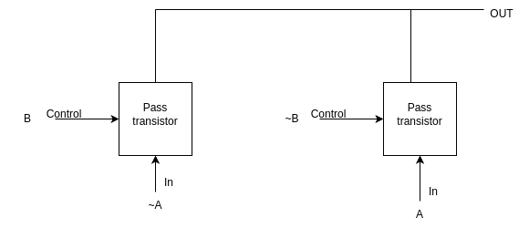

# Spice Code Platform

## Code -  

- The code block that defines the name of the gate, includes file, and declares parameters should be placed first, followed by the code block that defines the voltage source, then the block that defines the inverter subcircuit, followed by the netlist statement that instantiates and calls the respective gate subcircuit, then the block that defines the input waveform 'a', 'b' followed by the control statements to run the circuit and plot the required graphs, and then finally the end of code block.
- Drag and drop the code blocks to arrange them in the order mentioned above.
- Now enter the name of the MOSFET model file to be included ("PTM_45nm.txt").
- To define the voltage source, enter a name for it and then select vdd as the positive terminal and 0 or gnd as the negative terminal.
- Now, define the subcircuit by giving it a name and also giving names to the input and output arguments of the subckt.
- Inside this subcircuit, we need to call invverter and pass transistor sub circuits which are built using pmos and nmos and these connections are given as follows:
 *INSTANCE_NAME DRAIN GATE SOURCE BODY NAME_OF_MOSFET_AS_MENTIONED_IN_MODEL_FILE_INCLUDED w=WIDTH l=LENGTH*
 An instance name to both nmos and pmos mosfets are given, then we need to connect the body of pmos to vdd, and of nmos to gnd or 0 respectively and rest of theconnections accordingly as shown in previous experiments.
- Then inside the main subckt block, instantiate the inverter and pass transistor subcircuits according to the following connections in the figures.

 **Connections for XOR**
 

  **Connections for XNOR**
 

- Now end the subckt block by '.ends'.
- Now call this gate subcircuit by giving an instance name, then by giving 'a', 'b' as inputs and 'out' as output and then complete the call by typing in the respective gate subckt name.
- **Note** : *While giving names to the subcircuit, nodes, variables and instance names, make sure that they begin with either alphabets, '%', '$' or '_' charachter only and they can only contain alphanumeric characters,'%', '$' and '_' charachters only. The spice code is case insensitive so make sure to not give same names to any 2 variables in the same circuit or subcircuit irrespective of the case.*

## Observations -

- On clicking "validate" option after completing the code (assuming everything is filled correctly) you should see a "Success" message, a report, an input graph and an output graph under the observations section.
- Observe the input wave and the corresponding output wave.

